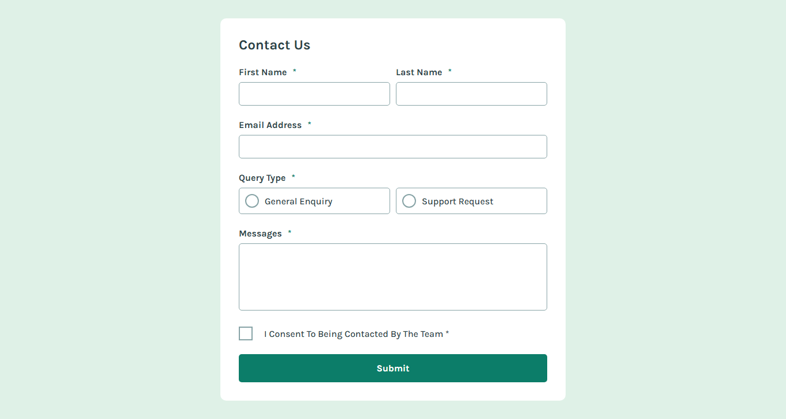
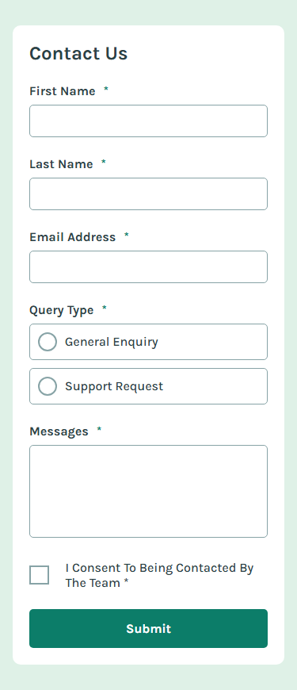
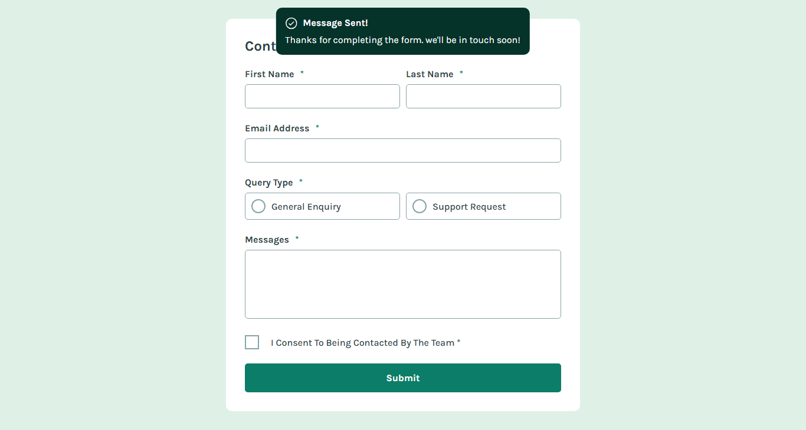
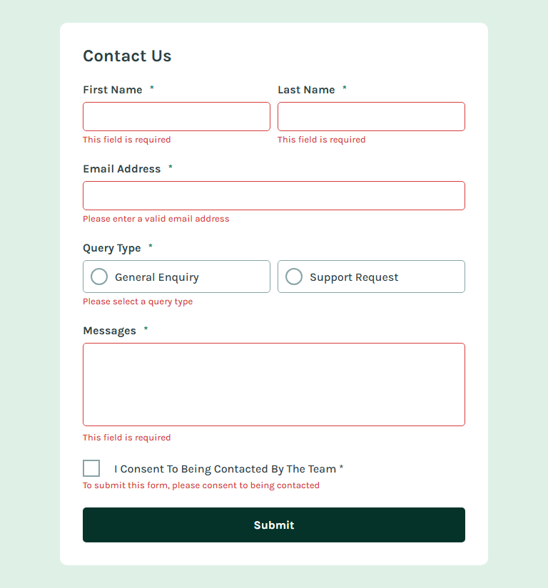

# Frontend Mentor - Contact Form Solution

This is my solution to the Frontend Mentor Contact Form challenge, focusing on creating an accessible and responsive form interface.

## Table of contents

- [Overview](#overview)
  - [The challenge](#the-challenge)
  - [Screenshot](#screenshot)
  - [Links](#links)
- [My process](#my-process)
  - [Built with](#built-with)
  - [Key Features](#key-features)
  - [Development Highlights](#development-highlights)
  - [Useful resources](#useful-resources)
- [Author](#author)

## Overview

### The challenge

Built a fully accessible contact form with:

✅ Form validation
✅ Success toast messages
✅ Keyboard navigation support
✅ Screen reader compatibility
✅ Responsive design
✅ Interactive states

### Screenshot

### Links

- Live Site: [Add your deployed URL]
- Repository: [Add your repo URL]

## My process

### Built with

- HTML5 semantic markup
- CSS custom properties
- Flexbox & Grid
- JavaScript form validation
- Scss
- jQuery

### Key Features

- Client-side form validation
- Custom error messaging
- Toast notifications
- Keyboard navigation support
- Screen reader announcements
- Responsive layout

### Development Highlights

- Implemented accessible form validation
- Created responsive layout using CSS Grid/Flexbox
- Added ARIA labels and roles for screen readers
- Built custom toast notification system
- Ensured keyboard navigation functionality

## Author

- Website - [Mutairu Lawal](https://mutairu-lawal.netlify.app/)
- Frontend Mentor - [@mtlaw200](https://www.frontendmentor.io/profile/mtLaw200)
- Twitter - [@Amdrealmtlaw](https://twitter.com/Amdrealmtlaw)
